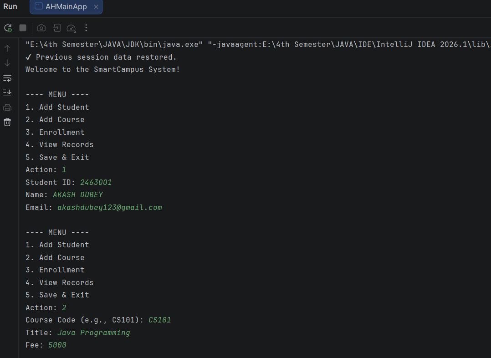
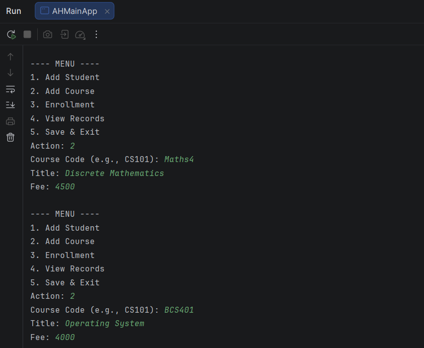
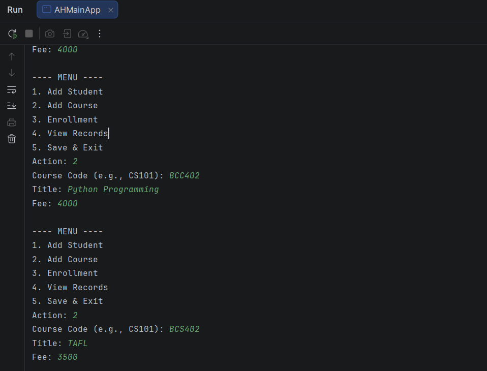
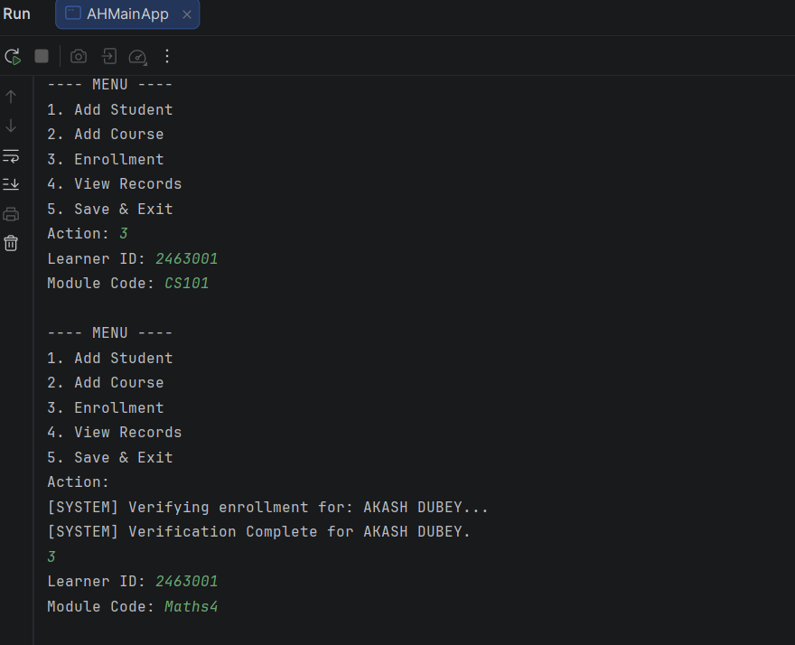
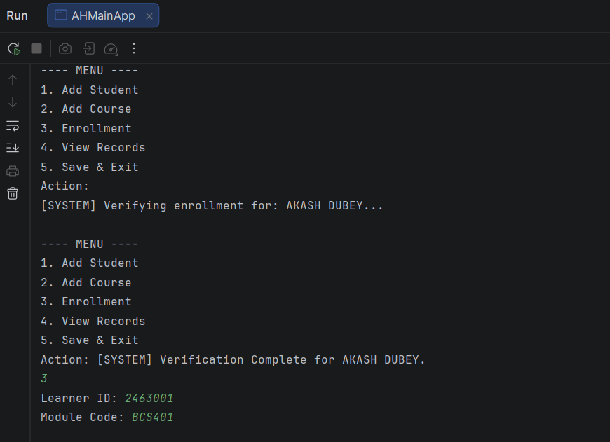
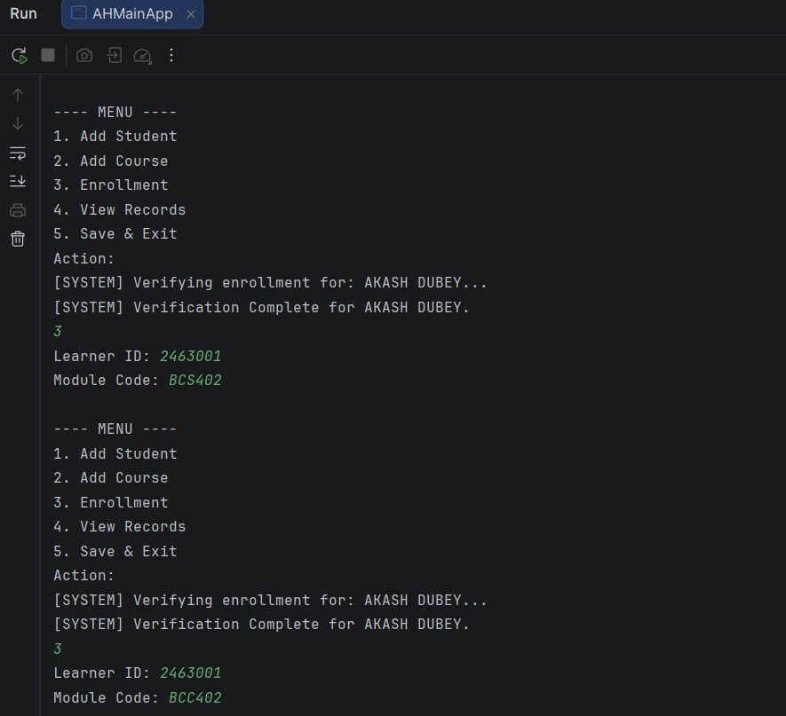
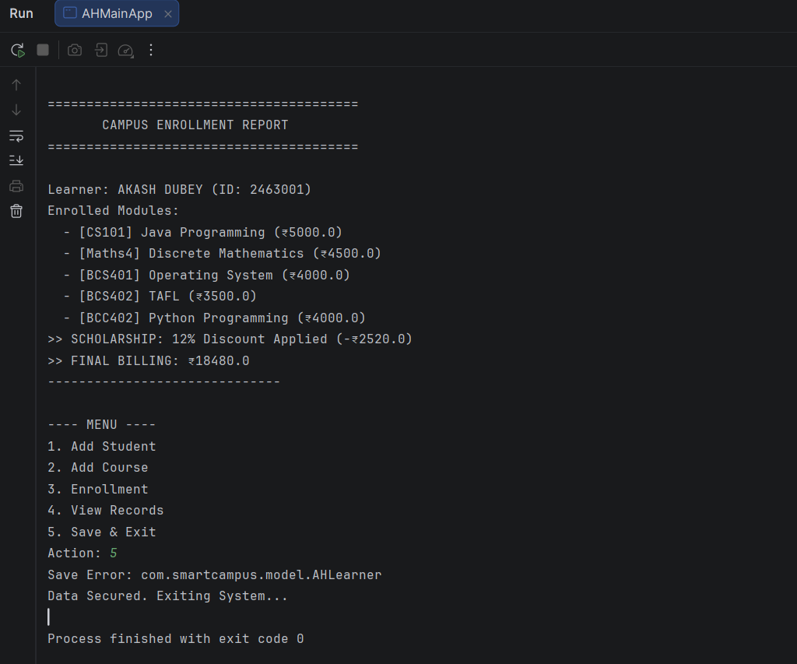

#  SmartCampus Management System (Final Assessment)

**Developer:** ALBINUS HEMBROM  
**Date:** April 16, 2026  
**Course:** CORE & ADVANCE JAVA TRAINING  
**Repository:** `[gnc-java-final-assessment-smartcampus](https://github.com/AlbinusHembrom/Java-Learning-Journey/tree/main/AHSmartCampusSystem)`

---

##  Project Overview
The **SmartCampus System** is a high-performance console application built as a final Java Intern assessment. It manages student (Learner) data and course (Module) enrollments with a focus on **Object-Oriented Design**, **Data Persistence**, and **Asynchronous Processing**.

##  Key Features
* **Alphanumeric Module IDs:** Supports realistic course codes like `CS101` or `MATH-IV`.
* **Persistent Storage:** Data is saved to `campus_data.ser` on exit and restored on startup.
* **Threaded Verification:** Enrollment processes run on a background thread to simulate a real-world database sync.
* **Automated Billing:** Calculates totals instantly with scholarship logic.

##  Technical Requirements Met
I implemented the following core Java pillars to satisfy the assessment rubric:

1.  **OOP Implementation:** * **Encapsulation:** Private fields in `AHLearner` and `AHCourseModule` protected by public getters.
    * **Abstraction:** Used custom classes to model real-world campus entities.
2.  **Collections Framework:** * `HashMap`: For $O(1)$ constant-time lookup of Learners and Modules.
    * `ArrayList`: To handle one-to-many relationships (one student, multiple courses).
3.  **Exception Handling:** * Developed `AHCampusException` to handle logic errors (e.g., enrolling a non-existent student).
    * Used `try-catch` blocks to prevent crashes from invalid user inputs.
4.  **Multithreading:** * Used the `Thread` class in `AHSyncProcessor` to handle "Asynchronous Enrollment Processing."
5.  **File Handling (Bonus):** * Utilized **Java Serialization** (`ObjectOutputStream`) to keep data saved on the E: Drive.

##  Unique Feature: Multi-Course Scholarship
I added a unique **Bundle Scholarship** logic to reward high-enrollment learners.
* **The Logic:** If a student enrolls in **3 or more** modules, the system applies a **12% discount** to the total bill.
* **Formula:** $$\text{Total Bill} = \left( \sum \text{Module Fees} \right) \times 0.88$$

##  Setup & Run Instructions
1.  **Import:** Open the folder in IntelliJ IDEA.
2.  **SDK:** Set Project SDK to **Java 17 or higher**.
3.  **Run:** Right-click `src/AHMainApp.java` and select **Run**.
4.  **Save:** Always use **Option 5 (Save & Exit)** to ensure your data is written to the disk.

##  Screenshots
### Part 1: Data Entry

### Part 2: Final Enrollment Report

##  Architectural Decisions & Scenario Analysis
During the development of the **SmartCampus System**, I evaluated several architectural scenarios to ensure the application is both performant and scalable. Below is the technical reasoning for the design choices made:

### 1. Optimal Collections Design
* **Problem:** The system requires a quick lookup of a student and their associated list of multiple courses.
* **Solution:** **`HashMap<Student, ArrayList<Course>>`**

### 2. Robust Exception Handling
* **Problem:** Handling invalid business logic data, such as a student entering a negative course fee.
* **Solution:** **Custom Exception Handling (`AHCampusException`)**

### 3. Thread Safety & Synchronization
* **Problem:** Multiple asynchronous threads (SyncProcessors) accessing the same enrollment list simultaneously, leading to "Race Conditions."
* **Solution:** **Synchronized Blocks**

### 4. OOP Design & Method Enforcement
* **Problem:** Enforcing a rule that every type of course must implement a `calculateFee()` method, while allowing unique logic for each.
* **Solution:** **Interfaces**
